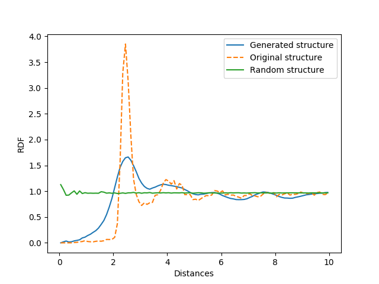

# RDF Plot examples 

- Evaluate radial distribution function for original structure (.traj files): rdf_for_org_structure.py
- Evaluate radial distribution function for generated structure: rdf_for_new_structures.py
- Compare structures with: compare_structure_rdf.py

## Unsorted with 8000 snapshots used, sigma = 0.25

## Unsorted with 40000 snapshots used, sigma = 0.10 and layers with 256 units
RDF reconstruction error: 0.12050458005585839

