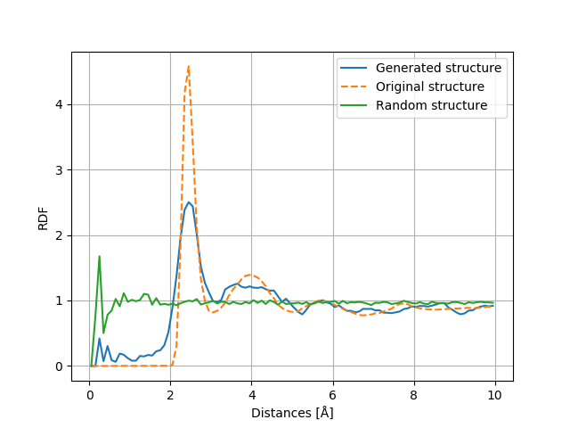

# RDF Plot examples 

## Unsorted with 8000 snapshots used, sigma = 0.25

run with: python3 compare_structure_rdf.py "/home/wamberg/Dokumenter/DTU/3 Del/RNN project/trajectories/structures_array_m4_s025_unsort_8000.npy" "/home/wamberg/Dokumenter/DTU/3 Del/RNN project/trajectories/new.traj"

## Unsorted with 40000 snapshots used, sigma = 0.10 and layers with 256 units

